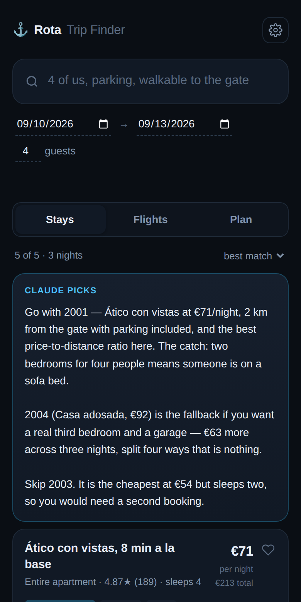

# ⚓ Rota Trip Finder

Cheap stays, cheap flights and a day-by-day plan for the **Naval Station Rota, Spain** area — from one search box you type a sentence into.

Static frontend on **GitHub Pages**. All API keys live in a **Cloudflare Worker** you deploy once. Friends just open the link.

**Also on this site: [Rota Range Rings](rings/)** — a drive-time chart of 154 remote, cool, easy trips from Rota. Rings are hours of driving; every pin opens a super-simple brief (what it is, the one thing to do, parking in one line — the deep detail folds away), with a first-load tutorial, a 🎲 surprise-me button, saved places, a smart type-in filter (`"castles in france under 12 h"`), and a **Live intel** card that asks Claude — through the same Worker (`POST /api/spot`, web search, cached 12 h) — what's happening at a destination right now.

**API setup in one script.** Run `./setup-api.sh` from the repo root: it prompts for your Anthropic key (and an optional access code for friends), stores them as Cloudflare secrets, and deploys the Worker. Nothing secret ever touches the website.



---

## How it gets around the API problem

Airbnb killed public API access years ago and every flight API needs a secret key — but GitHub Pages is static, so anything in the JS is readable by anyone. The split:

```
 phone / laptop
      │
 GitHub Pages ········ static HTML+CSS+JS, zero secrets, free, one shareable link
      │  fetch() + shared access code
 Cloudflare Worker ··· holds every key · free tier 100k req/day
      ├──► RapidAPI    stays (Airbnb13) + flights (Sky-Scrapper) — one key
      └──► Anthropic   Claude
```

Nothing but you ever sees a key. The Worker enforces an origin allowlist and a shared passphrase, so a stranger who finds the URL can't spend your quota.

**It works before you configure anything.** With no Worker at all the site runs on sample Rota listings and a curated area plan, so it's shareable on day one.

---

## What it does

**One input.** Type `4 of us, needs parking, walkable to the gate, under €100` and it extracts guests, budget, must-haves, search radius and ranking weights. That parsing runs **locally in the browser first**, so it works with no key; Claude refines it when configured. Everything it inferred shows as a chip you can tap away.

**Stays** ranked on price, distance to the base gate, parking, space and reviews — each card says in plain words why it ranked there. Parking, pool and A/C are detected in **English and Spanish** (`aparcamiento`, `cochera`, `piscina`), because half the Rota-area hosts write their listings in Spanish.

**Flights** across several origin airports at once, cheapest first.

**Any destination.** The "where to" box geocodes through Open-Meteo (free, keyless) — Rota by default, but type `Algarve, Portugal` or `Asheville` and stays, flights and distances all follow. Each card carries a live weather chip for the destination, same keyless API.

**Saved + share.** Heart anything and it lands in the Saved tab (with a badge). Hit Share and your friends open the same shortlist — the actual picture cards, prices and criteria, before live search even returns. State is in the URL — no database, no accounts.

One sunset-glass look, implemented from the Claude Design canvas (`Spain Vacation.dc.html`) on the "Classical" design-system tokens. Three tabs — Stays, Flights, Saved — and nothing else. (The old Rota day-planner endpoint still lives in the Worker for anyone who wants it back.)

---

## Does it actually work? Check, don't hope

Settings → **Run diagnostics** fires a real probe query at every provider and reports back:

```
endpoint   ✓ reachable
stays      ✓ 24 listings, 100% priced
flights    ✓ 6 offers, cheapest €44
Claude     ✓ claude-sonnet-4-5
```

If a provider changes its schema — the usual failure for third-party Airbnb data — you get `listings found but 0% priced` and the raw field names it actually saw, instead of a screen of blank cards. The Worker refuses to return a result set where nothing priced, so that failure is loud.

```bash
cd worker && npm test
```

Runs 24 end-to-end tests against the real Worker with stubbed upstreams — routing, CORS, access codes, Sky-Scrapper airport resolution, four different provider response shapes, schema-drift detection, partial flight failures, and the planner's invented-place filter. Plus unit tests on the distance maths and normalizer.

The Sky-Scrapper request and response shapes were verified against the API's published docs, and the legacy Amadeus parameter names against [their published OpenAPI spec](https://github.com/amadeus4dev/amadeus-open-api-specification) — not guessed.

---

## Deploy

### The one-command way

```bash
./launch.sh
```

It checks your tools, asks for each API key (paste it, or press Enter to skip — skipped ones run in demo mode), deploys the Worker, wires the site to it, pushes to GitHub, turns on Pages, and prints the link plus access code to send your friends. Re-run it any time to add a key you skipped. Keys go straight into Cloudflare secrets — never onto disk or into git.

You'll want the keys from step 2 below ready before you run it. Prefer to see each move? The manual steps:

### 1. GitHub Pages

```bash
git init && git add -A && git commit -m "Rota Trip Finder"
gh repo create rota-trip-finder --public --source=. --push
```

**Settings → Pages → Source: GitHub Actions.** Live at `https://<you>.github.io/rota-trip-finder/`, in demo mode, immediately.

### 2. Keys

| Secret | Where | Cost |
|---|---|---|
| `RAPIDAPI_KEY` | [rapidapi.com](https://rapidapi.com/) — subscribe the one key to **both** [Airbnb13](https://rapidapi.com/3b-data-3b-data-default/api/airbnb13) (stays) and [Sky-Scrapper](https://rapidapi.com/apiheya/api/sky-scrapper) (flights) | Free tiers: ~100 req/month each, card on file required. ~$10/mo each if the group gets heavy use. The Worker caches results for 6 h so repeat opens of a shared link cost zero quota. |
| `ANTHROPIC_API_KEY` | [console.anthropic.com](https://console.anthropic.com/) | Pennies per search at this volume |
| `ACCESS_CODE` | You invent it | Free. Give it to your friends only. |

> Amadeus decommissioned its self-service portal in July 2026, so new flight
> credentials can't be created there any more. If you hold pre-decommission
> `AMADEUS_CLIENT_ID`/`_SECRET`, set them and the Worker uses Amadeus instead.

### 3. Worker

```bash
cd worker && npm install && npx wrangler login
for s in RAPIDAPI_KEY ANTHROPIC_API_KEY ACCESS_CODE; do
  npx wrangler secret put $s
done
npx wrangler deploy
```

### 4. Connect

In `worker/wrangler.toml` set `ALLOWED_ORIGINS = "https://<you>.github.io"` and redeploy. In `config.js` set `API_BASE` to the Worker URL. Push.

Now the link works for everyone with the access code, no setup on their end. (Leave `API_BASE` empty instead and each person pastes the endpoint once under ⚙ — stored in their browser only.)

---

## Swapping the stay provider

Third-party Airbnb scrapers come and go. `worker/src/providers.js` keeps *how to ask* separate from *how to read the answer*:

```toml
STAY_PROVIDER = "airbnb13"   # or "apify", or "generic"
RAPIDAPI_HOST = "airbnb13.p.rapidapi.com"
```

The normalizer already handles a dozen field conventions (`price.rate` / `pricePerNight` / `pricing.total`, `lat` / `coordinates.latitude` / `geo.lat`, nested `rating.value`) and derives per-night from total when only a total is given. Adding a provider means one entry in `PROVIDERS`, not a rewrite.

---

## Local dev

```bash
cd worker
node test/devserver.mjs 8787          # real Worker, stubbed upstreams
python3 -m http.server 8899 --directory ..
```

Open `localhost:8899`, put `http://localhost:8787` in ⚙, and you're running the full stack offline.

---

## Notes

- Distances are straight-line km to the base gate (36.645, −6.3494), not driving distance.
- "No parking listed" means *not listed* — it depends on what the host wrote.
- Prices are a snapshot from when you searched. Confirm on the booking site.
- Drive times in the planner are approximate.
- Not affiliated with Airbnb, Skyscanner or Anthropic.
